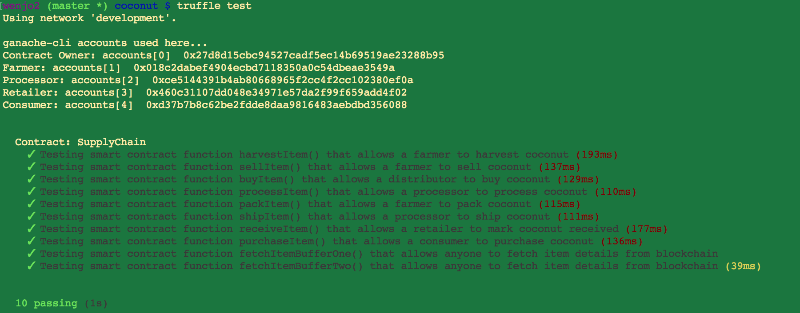

# Coconut Supply chain & data auditing

This repository contains an Ethereum DApp that demonstrates a Coconut Supply Chain flow which goes from farmer, processor, retailer to consumer. The user story is similar to any commonly used supply chain process. A Seller can add items to the inventory system stored in the blockchain. A Buyer can purchase such items from the inventory system. Additionally a Seller can mark an item as Shipped, and similarly a Buyer can mark an item as Received.

This is the detailed flow of the DApp:
- Farmer harvests coconuts
- Farmer sells coconuts
- Processor buys coconuts
- Processor processes coconuts
- Processor packs coconuts
- Processor ships coconuts to the Retailer
- Retailer receives coconuts from the Processor.
- Consumer purchases coconuts from the Retailer.

Below is the Sequence Diagram:


The DApp User Interface when running should look like...


## Getting Started

These instructions will get you a copy of the project up and running on your local machine for development and testing purposes. See deployment for notes on how to deploy the project on a live system.

### Prerequisites

- [npm](https://www.npmjs.com/) (Node.js package manager)
- [Truffle](https://truffleframework.com/) to compile, deploy and test smart contracts.
- [http-server](https://www.npmjs.com/package/http-server) A command-line http server.
- [Metamask](https://metamask.io/) Ether wallet.

### Installing

- Install http-server if you don't have it yet.
```
npm install http-server -g
```

- Install Truffle if you don't have it yet.
```
npm install truffle -g
```

- Install Truffle HDWallet Provider
```
npm install --save truffle-hdwallet-provider
```

### Configuring

- Initialize Truffle
```
truffle init
```

- Go to [Infura.io](https://www.infura.io/). 
  - Create an account and a new project.
  - Change the endpoint to **Rinkeby** Test Network.
  - Copy the link to be used later in the truffle.js configuration part.

- Install Metamask and create account.
  - Make sure to point to **Rinkeby** network.
  - To fund your wallet to be used for **Rinkeby** network, go to this (faucet)[https://faucet.rinkeby.io/] and follow the instructions.
  - Get the wallet seed to be used later in the the truffle.js configuration part.

- Go to truffle.js (for Mac or truffle-config.js for Windows).
  - Replace **[Metamask wallet seed goes here]** with the Metamask seed you got from above instructions..
  - Replace **[Infura link goes here]** with the Infura link you got from above instructions.

### Testing

Launch Ganache:

```
ganache-cli -m "spirit supply whale amount human item harsh scare congress discover talent hamster"
```

Your terminal should look something like this:


In a separate terminal window, Compile smart contracts:

```
truffle compile
```

This will create the smart contract artifacts in folder ```build\contracts```.

Migrate smart contracts to the locally running blockchain, ganache-cli:

```
truffle migrate
```

Your terminal should look something like this:


Test smart contracts:

```
truffle test
```

All 10 tests should pass.




### Deploying to Rinkeby Network

- To migrate for the first time to **Rinkeby** Test Network
```
truffle migrate --network rinkeby
```
or 
- To migrate onwards
```
truffle migrate --reset --network rinkeby
```

### Launching DApp

- Go to the coconut directory

- Launch the http-server by doing: ***http-server***

- Open index.html

- Start tracking coconuts.


## Built With

* [Ethereum](https://www.ethereum.org/) - Ethereum is a decentralized platform that runs smart contracts
* [IPFS](https://ipfs.io/) - IPFS is the Distributed Web | A peer-to-peer hypermedia protocol
to make the web faster, safer, and more open.
* [Truffle Framework](http://truffleframework.com/) - Truffle is the most popular development framework for Ethereum with a mission to make your life a whole lot easier.

## Acknowledgments

* Solidity
* Ganache-cli
* Truffle
* IPFS
