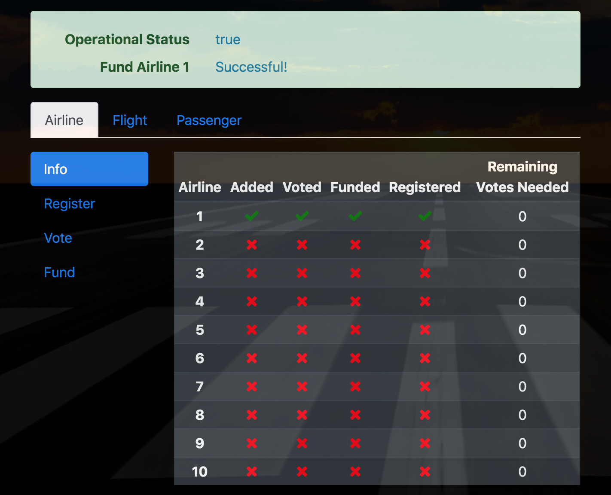

# FlightSurety

FlightSurety is a sample application project for Udacity's Blockchain course. This supports registration of airlines and flights. Passengers can buy insurance as well. In the event a registered flight is delayed, the passenger receives a payout of 1.5 times the
amount of insurance bought. 

## Install

This repository contains Smart Contract code in Solidity (using Truffle), tests (also using Truffle), dApp scaffolding (using HTML, CSS and JS) and server app scaffolding. In addition, it incorporates Bootstrap, FontAwesome and JQuery to build a user-friendly interface.

To install, download or clone the repo, then:

`npm install`
`truffle compile`

## Setup and Run Ganache
Ensure ganache generates atleast 50 accounts and uses the Mnemonic below:

`thought family poverty reunion salad van bacon combine expect level ozone discover`

Ensure it runs on port 8545

## Develop Client

To run truffle tests:

`truffle test ./test/flightSurety.js`
`truffle test ./test/oracles.js`

To use the dapp:

`truffle migrate --reset`
`npm run dapp`

To view dapp:

`http://localhost:8000`

## Develop Server

`npm run server`
`truffle test ./test/oracles.js`

## Usage

The app has 3 main sections: **Airline**, **Flight**, and **Passenger**.
Select the appropriate tab to go its respective section.

##### Airline
-----

In the Airline section, you can:
1. Check the registration status of the airlines
2. Register an airline
3. Vote an airline
4. Fund an airline.

***Info tab***

This shows the registration status of each airlines. As you can see
the 1st airline is funded and registered automatically.

***Register tab***

Airlines 2-4 once registered it will be funded and registered right away.

Subsequent airlines once registered by a registered airline will need to get enough consensus votes to proceed to funding stage.

***Vote tab***

Select an airline and registered airline as such:
Only registered airlines that haven't voted will display in the dropdown.

***Fund tab***

Select an airline which needs to be funded. Once funded, it will be considered registered.

##### Flight
-----
In the Flight section, you can:
1. Register a flight and 
2. Simulate the status of the flight.

***Register Tab***

Select a registered airline and supply the flight name as such:

***Simulate Tab***

Select a registered airline and corresponding registered flight to simulate:

##### Passenger
-----
In the Passenger section, you can:
1. Buy Insurance
2. Check Payout
3. Withdraw Payout

***Buy Tab***

In addition to passenger info and amount to purchase, you need to supply the particular airline and flight to buy:

***Payout out***

Here you can check the payout for passenger who bought insurance and had a delayed flight by clicking the **Check Payout** button.

Withdrawing payout is done via **Withdraw Payout** button.

## Deploy

To build dapp for prod:
`npm run dapp:prod`

Deploy the contents of the ./dapp folder

## Resources

* [How does Ethereum work anyway?](https://medium.com/@preethikasireddy/how-does-ethereum-work-anyway-22d1df506369)
* [BIP39 Mnemonic Generator](https://iancoleman.io/bip39/)
* [Truffle Framework](http://truffleframework.com/)
* [Ganache Local Blockchain](http://truffleframework.com/ganache/)
* [Remix Solidity IDE](https://remix.ethereum.org/)
* [Solidity Language Reference](http://solidity.readthedocs.io/en/v0.4.24/)
* [Ethereum Blockchain Explorer](https://etherscan.io/)
* [Web3Js Reference](https://github.com/ethereum/wiki/wiki/JavaScript-API)

* [Bootstrap](https://getbootstrap.com)
* [JQuery](https://jquery.com)
* [FontAwesome](https://fontawesome.com)