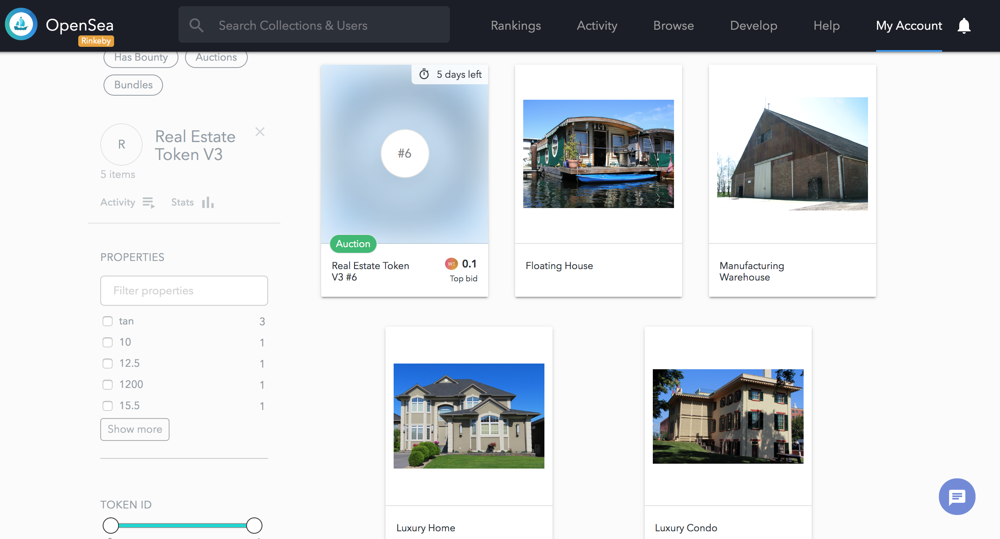
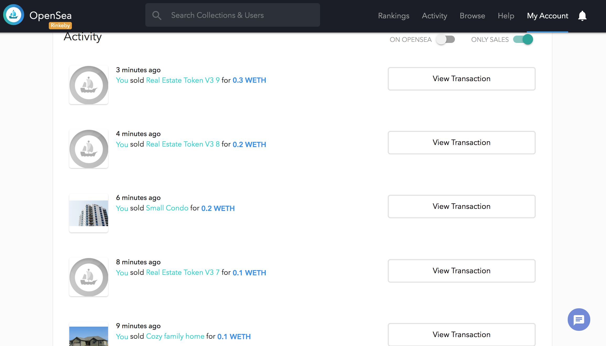

# Udacity Blockchain Capstone: Real Estate Marketplace

Real Estate Marketplace is the Capstone for the Udacity Blockchain Course. In this project, we created a custom ERC721Token in which we mint and deply to [OpenSea](https://opensea.io/). It uses [Zokrates](https://github.com/Zokrates/ZoKrates) to verify the uniqueness of the token.

## Installation

- Run default install
```
npm install
```

- Install Truffle HDWallet Provider, if missing
```
npm install truffle-hdwallet-provider
```

- Install [Docker](https://docs.docker.com/install/), if missing. 

## Tests

In ***eth-contract*** directory, you can do either:

* Run the whole test suite: 

```truffle test```


* Run individual tests:

```truffle test test/TestERC721Mintable.js```


```truffle test test/TestSquareVerifier.js```


```truffle test test/TestSolnSquareVerifier.js```


## Deployment

### Collect information
1. You'll need to sign up for [Infura](https://infura.io/), create a new project. and get an API key.
2. Get the mnemonic 12-word phrase from your Metamask wallet (make sure you're using a Metamask seed phrase that you're comfortable using for testing purposes).

### Configure truffle-config.js
1. Create a ```.secret``` file in the same directory as truffle.config. Paste your metamask mnemonic 12-word phrase.
2. Uncomment this whole block of code.
```
const HDWalletProvider = require('truffle-hdwallet-provider');
const infuraKey = "<infura key>";

const fs = require('fs');
const mnemonic = fs.readFileSync(".secret").toString().trim();
```
3. Replace *** <infura key> *** with your real infura key.
4. Uncomment the network section for ***rinkeby***.
5. Provide your metamask account number in the ***<your contract owner address>*** section.

### Deploying to the Rinkeby Network
1. Using your Infura API key and the mnemonic for your Metamask wallet (make sure you're using a Metamask seed phrase that you're comfortable using for testing purposes), run:

```
export INFURA_KEY="<infura_key>"
export MNEMONIC="<metmask_mnemonic>"
truffle deploy --network rinkeby
```
### Minting tokens
1. Generate the necessary proof.json files you need by doing the following:

- Run Docker container:
```
docker run -v /Users/wenjo2/Dev/Udacity/BCND/P9/Capstone/zokrates/code:/home/zokrates/code -ti zokrates/zokrates /bin/bash
```

- Navigate to the square directory:
```
cd code/square
```

- Compile Program
```
~/zokrates compile -i square.code
```

- Trusted Setup
```
~/zokrates setup --proving-scheme pghr13
```

- Compute Witness
```
~/zokrates compute-witness -a 3 9
```

- Generate Proof
```
~/zokrates generate-proof --proving-scheme pghr13
```

- Export Verifier
```
~/zokrates export-verifier --proving-scheme pghr13
```

2. Move the proofs json in the data/ directory and make sure its suffixed with "-(index)". For instance, proof-1.json, proof-2.json, etc.

3. Deploy the contract to rinkeby:

```
truffle migrate --reset --network rinkeby
```

Here are the contracts in the rinkeby network:

[SquareVerifer](https://rinkeby.etherscan.io/address/0x755210c2696e0e69e76df7bc88f0ddce268a06ac)

[SolnSquareVerifier](https://rinkeby.etherscan.io/address/0xb25377d851fda8ebb73c6b87a3bca3aa6f2a44a6)


4. Once the contract has been deployed to the rinkeby network, collect the contract address and use it in ** <contract_address> **. Then in your metamask, collect your metamask account and use it in ** <my_address> ** before running the minting script.

```
export OWNER_ADDRESS="<my_address>"
export CONTRACT_ADDRESS="<contract_address>"
export NETWORK="rinkeby"
node scripts/mint.js
```

### Listing on OpenSea

Once the tokens are already assigned to an owner, the owner can list/sell tokens on the [OpenSea](https://opensea.io/). In order to list a property, you'll need to go to the item on your account page. On the item detail page, click **"Sell"**. This will walk you through the steps for selling an item. Note that the first time you auction an item, you will need to complete several MetaMask transactions in order to give the exchange contracts access to your items. After you complete these initial steps, creating an auction will only require signing a MetaMask message. This means that you can auction items without paying gas.

In our case, we have minted 10 token to the owner address using the mint script in section 4. Then, we listed 10 tokens on [OpenSea](https://opensea.io/). Sold 5 tokens to different account addresses as seen below:



Thus, we are left with 5 tokens:



## Project Resources


* [Remix - Solidity IDE](https://remix.ethereum.org/)
* [Visual Studio Code](https://code.visualstudio.com/)
* [Truffle Framework](https://truffleframework.com/)
* [Ganache - One Click Blockchain](https://truffleframework.com/ganache)
* [Open Zeppelin ](https://openzeppelin.org/)
* [Interactive zero knowledge 3-colorability demonstration](http://web.mit.edu/~ezyang/Public/graph/svg.html)
* [Docker](https://docs.docker.com/install/)
* [ZoKrates](https://github.com/Zokrates/ZoKrates)
* [OpenSea](https://opensea.io/)
