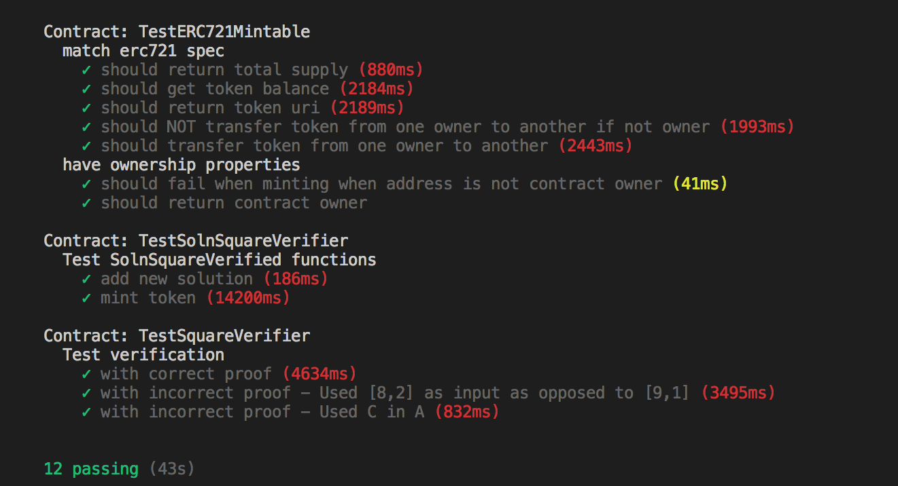
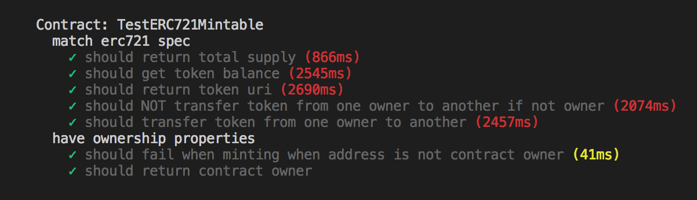
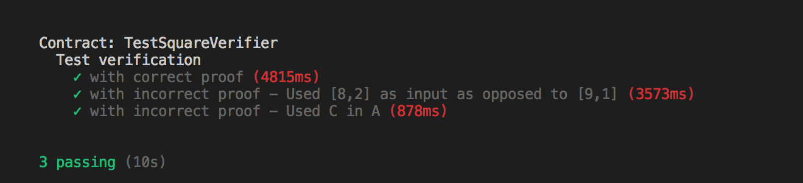
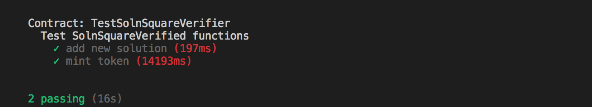

# Udacity Blockchain Capstone: Real Estate Marketplace

Real Estate Marketplace is the Capstone for the Udacity Blockchain Course. In this project, we created a custom ERC721Token in which we mint and deply to [OpenSea](https://opensea.io/). It uses [Zokrates](https://github.com/Zokrates/ZoKrates) to verify the uniqueness of the token.

## Installation

- Run default install
```
npm install
```

- Install Truffle HDWallet Provider, if missing
```
npm install truffle-hdwallet-provider
```


## Tests

In ***eth-contract*** directory, you can do either:

* Run the whole test suite: 

```truffle test```



* Run individual tests:

```truffle test test/TestERC721Mintable.js```



```truffle test test/TestSquareVerifier.js```



```truffle test test/TestSolnSquareVerifier.js```




## Deployment

### Collect information
1. You'll need to sign up for [Infura](https://infura.io/), create a new project. and get an API key.
2. Get the mnemonic 12-word phrase from your Metamask wallet (make sure you're using a Metamask seed phrase that you're comfortable using for testing purposes).

### Configure truffle-config.js
1. Create a ```.secret``` file in the same directory as truffle.config. Paste your metamask mnemonic 12-word phrase.
2. Uncomment this whole block of code.
```
const HDWalletProvider = require('truffle-hdwallet-provider');
const infuraKey = "<infura key>";

const fs = require('fs');
const mnemonic = fs.readFileSync(".secret").toString().trim();
```
3. Replace ***<infura key>*** with your real infura key.
4. Uncomment the network section for ***rinkeby***.
5. Provide your metamask account number in the ***<your contract owner address>*** section.

### Deploying to the Rinkeby Network
1. Using your Infura API key and the mnemonic for your Metamask wallet (make sure you're using a Metamask seed phrase that you're comfortable using for testing purposes), run:

```
export INFURA_KEY="<infura_key>"
export MNEMONIC="<metmask_mnemonic>"
truffle deploy --network rinkeby
```
### Minting tokens
Once the contract has been deployed to the rinkeby network, collect the contract address and use it in **<contract_address>**. Then in your metamask, collect your metamask account and use it in **<my_address>** before running the minting script.

```
export OWNER_ADDRESS="<my_address>"
export CONTRACT_ADDRESS="<contract_address>"
export NETWORK="rinkeby"
node scripts/mint.js
```


## Project Resources


* [Remix - Solidity IDE](https://remix.ethereum.org/)
* [Visual Studio Code](https://code.visualstudio.com/)
* [Truffle Framework](https://truffleframework.com/)
* [Ganache - One Click Blockchain](https://truffleframework.com/ganache)
* [Open Zeppelin ](https://openzeppelin.org/)
* [Interactive zero knowledge 3-colorability demonstration](http://web.mit.edu/~ezyang/Public/graph/svg.html)
* [Docker](https://docs.docker.com/install/)
* [ZoKrates](https://github.com/Zokrates/ZoKrates)
